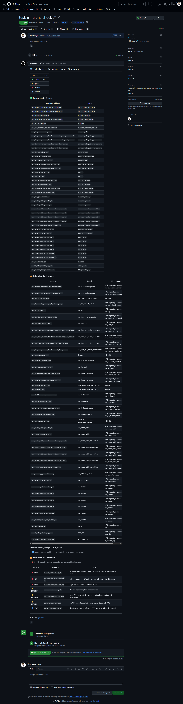

# 🔍 InfraLens

**Know exactly what your Terraform or CloudFormation PR will do — before it merges.**

InfraLens is a GitHub Action that analyzes your IaC plan and posts a structured impact summary directly on the pull request. Resource changes, live AWS cost estimates, and security risk detection — all in one PR comment, zero setup beyond 5 lines of YAML.

---

## Quick Start

### 1. Add the workflow to your repo

Create `.github/workflows/infralens.yml`:

```yaml
name: InfraLens PR Check

on:
  pull_request:
    paths:
      - '**.tf'

jobs:
  infralens:
    runs-on: ubuntu-latest
    permissions:
      pull-requests: write

    steps:
      - uses: actions/checkout@v4

      - name: Setup Terraform
        uses: hashicorp/setup-terraform@v3

      - name: Terraform Init
        run: terraform init

      - name: Terraform Plan
        run: |
          terraform plan -out=plan.bin
          terraform show -json plan.bin > plan.json
        env:
          AWS_ACCESS_KEY_ID: ${{ secrets.AWS_ACCESS_KEY_ID }}
          AWS_SECRET_ACCESS_KEY: ${{ secrets.AWS_SECRET_ACCESS_KEY }}
          AWS_DEFAULT_REGION: ${{ secrets.AWS_DEFAULT_REGION }}

      - name: Run InfraLens
        uses: devDhiraj12/infralens@v2
        with:
          plan-json-path: plan.json
          github-token: ${{ secrets.GITHUB_TOKEN }}
        env:
          AWS_ACCESS_KEY_ID: ${{ secrets.AWS_ACCESS_KEY_ID }}
          AWS_SECRET_ACCESS_KEY: ${{ secrets.AWS_SECRET_ACCESS_KEY }}
          AWS_DEFAULT_REGION: ${{ secrets.AWS_DEFAULT_REGION }}
```

### 2. Add GitHub secrets

Go to your repo **Settings → Secrets → Actions** and add:

| Secret | Value |
|--------|-------|
| `AWS_ACCESS_KEY_ID` | Your AWS access key |
| `AWS_SECRET_ACCESS_KEY` | Your AWS secret key |
| `AWS_DEFAULT_REGION` | e.g. `us-east-1` |

### 3. Open a PR that changes any `.tf` file

InfraLens runs automatically and posts the comment on the PR.

---

## What the PR Comment Looks Like



```
🔍 InfraLens — Terraform Impact Summary

| Action   | Count |
|----------|-------|
| 🟢 Create  | 4   |
| 🟡 Update  | 1   |
| 🔴 Destroy | 1   |
| 🔁 Replace | 0   |

🟢 Resources to Create
| Resource Address          | Type              |
|---------------------------|-------------------|
| aws_instance.web_server   | aws_instance      |
| aws_db_instance.database  | aws_db_instance   |
| aws_nat_gateway.nat       | aws_nat_gateway   |

💰 Estimated Cost Impact
| Resource                  | Detail                    | Monthly Cost |
|---------------------------|---------------------------|-------------|
| aws_instance.web_server   | t3.medium                 | +$30.37     |
| aws_db_instance.database  | db.t3.micro (mysql), 20GB | +$14.71     |
| aws_nat_gateway.nat       | NAT Gateway               | +$32.85     |
| aws_instance.old_server   | t2.micro                  | -$8.47      |

Estimated monthly change: +$69.46/month

🔒 Security Risk Detection

🚨 3 HIGH severity issue(s) found. Do not merge without review.

| Severity   | Resource                   | Risk                                     |
|------------|----------------------------|------------------------------------------|
| 🔴 HIGH    | aws_security_group.web_sg  | SSH (port 22) open to 0.0.0.0/0         |
| 🔴 HIGH    | aws_db_instance.database   | RDS instance is publicly accessible      |
| 🔴 HIGH    | aws_s3_bucket.assets       | [Custom] S3 versioning must be enabled   |
| 🟡 MEDIUM  | aws_db_instance.database   | RDS storage encryption is not enabled    |
| 🔵 LOW     | aws_s3_bucket.assets       | Versioning not enabled                   |
```

---

## Features

### Resource Diff
Shows every resource being created, updated, destroyed, or replaced in a clean table. Warns when a PR destroys or replaces resources.

### Live Cost Estimation
Uses the **AWS Pricing API** to fetch real-time prices on every run — no hardcoded tables, region-aware. Falls back to a built-in table automatically if AWS credentials are unavailable.

Supported resources:

| Terraform Resource | Pricing Method |
|-------------------|----------------|
| `aws_instance` | EC2 Pricing API (any instance type) |
| `aws_db_instance` | RDS Pricing API (engine + storage) |
| `aws_nat_gateway` | EC2 Pricing API |
| `aws_lb` / `aws_alb` | ELB Pricing API |
| `aws_elasticache_cluster` | ElastiCache Pricing API |
| `aws_eks_cluster` | Fixed $0.10/hr control plane |
| `aws_lambda_function` | Usage-based note |
| `aws_s3_bucket` | Usage-based note |
| `aws_ecs_service` | Usage-based note |

### Security Risk Detection
Scans every created, updated, or replaced resource and flags risks at three severity levels.

**🔴 HIGH — must fix before merging:**
- Security group with SSH (22), RDP (3389), or DB ports open to `0.0.0.0/0`
- Security group with all ports open to the world
- RDS instance with `publicly_accessible = true`
- RDS with hardcoded password — use AWS Secrets Manager
- S3 bucket with public ACL (`public-read`, `public-read-write`)
- IAM policy with `Action: *` or `Resource: *`
- IAM role with `Principal: *` in trust policy
- Hardcoded secrets detected in EC2 `user_data`

**🟡 MEDIUM — should review:**
- RDS storage encryption not enabled
- EKS API server publicly accessible
- New IAM role created — review permissions
- S3 `force_destroy = true`
- EC2 launched without explicit VPC/subnet

**🔵 LOW — good practice:**
- RDS without `deletion_protection`
- S3 versioning not enabled

### Fail CI on HIGH Severity
By default InfraLens fails the GitHub Actions check if any HIGH severity findings exist — blocking the merge until issues are resolved. Disable it per workflow with `block-on-high: false`.

### Custom Security Rules
Define your own rules in `.infralens.yml` at the root of your repo:

```yaml
rules:
  - resource: aws_s3_bucket
    field: versioning.enabled
    operator: equals
    value: true
    severity: HIGH
    message: "S3 versioning must be enabled per company policy"

  - resource: aws_db_instance
    field: multi_az
    operator: equals
    value: true
    severity: MEDIUM
    message: "RDS Multi-AZ must be enabled for production databases"

  - resource: aws_instance
    field: instance_type
    operator: not_equals
    value: t2.micro
    severity: LOW
    message: "t2.micro is previous gen — use t3.micro instead"
```

Supported operators: `equals`, `not_equals`, `contains`, `exists`, `not_exists`

Custom findings are tagged `[Custom]` in the PR comment so you always know the source.

### CloudFormation Support
InfraLens works with AWS CloudFormation changesets too, not just Terraform.

```yaml
      - name: Create Changeset
        run: |
          aws cloudformation create-change-set \
            --stack-name my-stack \
            --change-set-name pr-${{ github.event.pull_request.number }} \
            --template-body file://template.yml
          aws cloudformation describe-change-set \
            --stack-name my-stack \
            --change-set-name pr-${{ github.event.pull_request.number }} > changeset.json

      - name: Run InfraLens
        uses: devDhiraj12/infralens@v2
        with:
          plan-json-path: changeset.json
          plan-type: cloudformation
          github-token: ${{ secrets.GITHUB_TOKEN }}
```

---

## All Inputs

| Input | Required | Default | Description |
|-------|----------|---------|-------------|
| `plan-json-path` | Yes | `plan.json` | Path to Terraform plan JSON or CloudFormation changeset JSON |
| `github-token` | Yes | — | GitHub token for posting PR comments |
| `plan-type` | No | `terraform` | `terraform` or `cloudformation` |
| `block-on-high` | No | `true` | Fail CI if HIGH severity findings exist |

---

## Running Locally

You can run InfraLens locally before pushing to GitHub. It prints the full PR comment as a terminal preview without posting anything.

**Step 1 — Generate a Terraform plan JSON:**

```bash
terraform init
terraform plan -out=plan.bin
terraform show -json plan.bin > plan.json
```

On Windows PowerShell:
```powershell
terraform plan -out="plan.bin"
terraform show -json plan.bin | Out-File -Encoding utf8 plan.json
```

**Step 2 — Install dependencies:**

```bash
pip install requests boto3 pyyaml
```

**Step 3 — Set environment variables and run:**

```bash
export PLAN_JSON_PATH=plan.json
export AWS_ACCESS_KEY_ID=your-key
export AWS_SECRET_ACCESS_KEY=your-secret
export AWS_DEFAULT_REGION=us-east-1
python src/main.py
```

On Windows PowerShell:
```powershell
$env:PLAN_JSON_PATH="path\to\plan.json"
$env:AWS_ACCESS_KEY_ID="your-key"
$env:AWS_SECRET_ACCESS_KEY="your-secret"
$env:AWS_DEFAULT_REGION="us-east-1"
python src/main.py
```

---

## Environment Variables Reference

These are all the environment variables InfraLens reads — both in CI and locally. In the GitHub Action, inputs like `plan-json-path` and `block-on-high` map to these automatically. When running locally you set them yourself.

| Variable | Required | Default | Description |
|----------|----------|---------|-------------|
| `PLAN_JSON_PATH` | Yes | `plan.json` | Path to your Terraform plan JSON or CloudFormation changeset JSON |
| `PLAN_TYPE` | No | `terraform` | Set to `cloudformation` if using a CloudFormation changeset |
| `BLOCK_ON_HIGH` | No | `true` | Set to `false` to skip CI failure on HIGH findings — useful when testing locally or onboarding |
| `INFRALENS_RULES_PATH` | No | `.infralens.yml` | Path to your custom rules file. If the file doesn't exist, custom rules are skipped silently |
| `AWS_ACCESS_KEY_ID` | No | — | AWS credentials for live Pricing API calls. Without these, InfraLens falls back to a built-in price table |
| `AWS_SECRET_ACCESS_KEY` | No | — | AWS credentials |
| `AWS_DEFAULT_REGION` | No | `us-east-1` | Region used for cost estimation. Set this to match where you're deploying |
| `GITHUB_TOKEN` | CI only | — | Auto-provided by GitHub Actions. Not needed locally — without it InfraLens just prints the preview |
| `GITHUB_REPOSITORY` | CI only | — | Auto-provided by GitHub Actions |
| `GITHUB_PR_NUMBER` | CI only | — | Auto-provided by GitHub Actions |

**Common local testing scenarios:**

Test without AWS credentials (uses fallback pricing):
```powershell
$env:PLAN_JSON_PATH="plan.json"
$env:BLOCK_ON_HIGH="false"
python src/main.py
```

Test with custom rules:
```powershell
$env:PLAN_JSON_PATH="plan.json"
$env:INFRALENS_RULES_PATH=".infralens.yml"
python src/main.py
```

Test CloudFormation changeset:
```powershell
$env:PLAN_JSON_PATH="changeset.json"
$env:PLAN_TYPE="cloudformation"
python src/main.py
```


## Project Structure

```
infralens/
├── action.yml          # GitHub Action definition and inputs
├── Dockerfile          # Python container build
├── requirements.txt    # requests, boto3, pyyaml
├── README.md
└── src/
    ├── main.py         # Entry point — orchestrates all modules
    ├── parser.py       # Terraform plan JSON parser
    ├── cfn_parser.py   # CloudFormation changeset parser
    ├── cost.py         # AWS Pricing API cost estimation
    ├── security.py     # Built-in + custom security rule engine
    └── comment.py      # GitHub PR comment builder and poster
```

---

## Contributing

InfraLens is built to grow with community contributions. Good first PRs:

- Add support for new AWS resource types in `cost.py`
- Add new built-in security checks in `security.py`
- Add Azure or GCP resource support
- Add Pulumi or CDK plan support
- Share your `.infralens.yml` rule packs in the Discussions tab

Open an issue before starting large changes.

---

## Changelog

**v2**
- Fail CI on HIGH severity findings (opt-out with `block-on-high: false`)
- Custom security rules via `.infralens.yml`
- CloudFormation changeset support

**v1**
- Terraform plan parsing
- Live AWS cost estimation via Pricing API
- Built-in security scanning (IAM, SG, S3, RDS, EKS)
- GitHub PR comment with auto-update on push

---

## License

MIT — free to use, modify, and distribute.

---

*Built by [@devDhiraj12](https://github.com/devDhiraj12)*